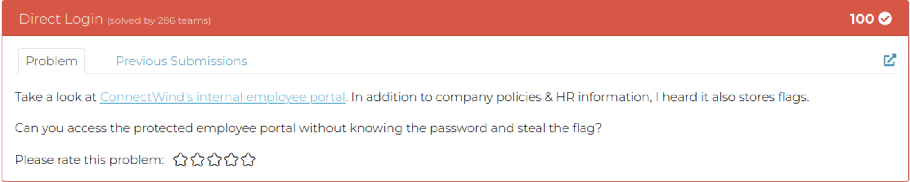
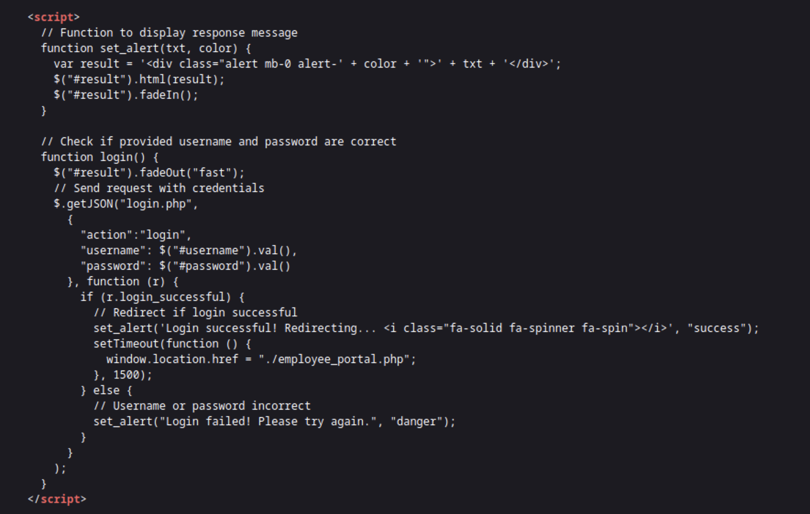
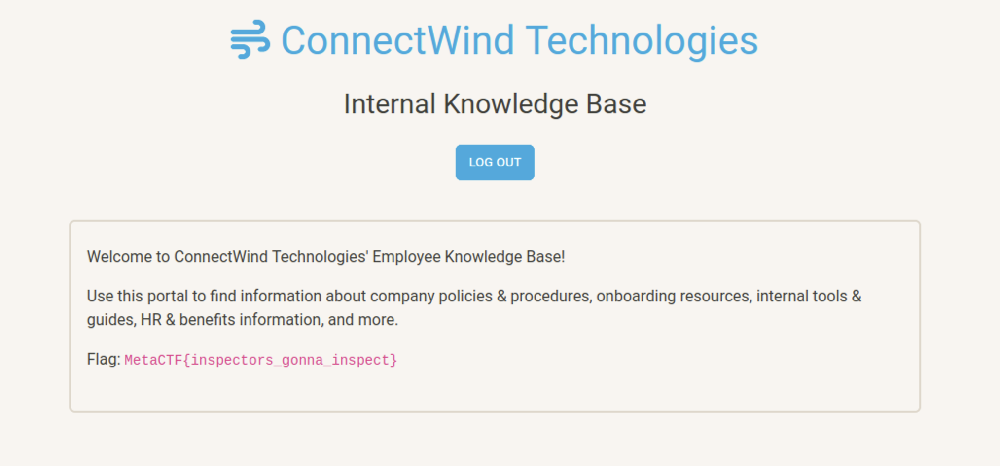
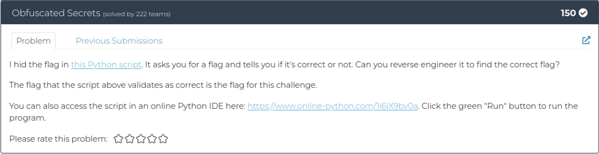
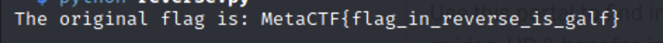
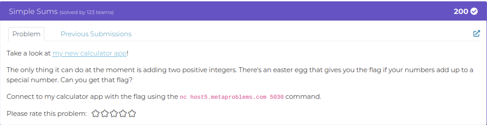

# February 2024 FlashCTF

## Web
### Direct Login
\
Start off by visiting the website link inside of the challenge description.\
At first glance, you will see a normal looking login page.\
\
One of the first things that I do when looking at a login page is to right click and inspect the `username` and `password` fields, if there isn't anything interesting in that (which there wasn't anything out of the normal), I will right click and view the page source.\
Scrolling through the page source, I noticed a script that sits at the bottom of the script and notice that it has something to do with the login.\
\
In the script, I noticed the line `// Redirect if login successful`\
Looking a little further down I see the directory that the user will be redirected to `./employee_portal.php`\
So I add that directory to the end of the URL to visit the page, and the flag is displayed.\


## Reverse Engineer
### Obfuscated Secrets
\
Start off by clicking the link `this Python script`\
When it's downloaded open the script in the text editor of your choice.\
```python
# METACTF FLAG CHECKER

# This program asks the user for a flag and responds with whether
#   the flag they entered is correct or incorrect.

# Receive input
entered_flag = input("Please enter the flag: ")

# Function to validate flags
def validate_flag(flag):
    # Some random string we need. The program doesn't seem to work without it ¯\_(ツ)_/¯
    encrypted = "Lcq]>N?s]bV[R[_OaScQ]]NGPYDKDNG]"
    # Check if length matches
    if len(flag) != len(encrypted): return False
    # Check if entered flag is correct
    return all([ord(flag[i]) - 1 == ord(encrypted[i]) + i for i in range(len(encrypted))])

# Print results
if validate_flag(entered_flag):
    print("Congrats! Your flag is correct.")
else:
    print("Sorry, your flag is incorrect. Please try again.")
```
Notice that there is a variable named `encrypted` that contains what I assumed to be the encrypted flag.\
Knowing that the flag starts with `MetaCTF{` and looking at the `# Check if entered flag is correct line` I was able to assume that the encryption was going 1 letter back for the first letter, 2 letters back for the second, and so on and so on.\
Knowing this, I was able to write a for loop that would handle that encryption.\
```python
def reverse_validate_flag(encrypted):
    decrypted_flag = ''
    for i in range(len(encrypted)):
        decrypted_flag += chr(ord(encrypted[i]) + i + 1)
    return decrypted_flag

encrypted_flag = "Lcq]>N?s]bV[R[_OaScQ]]NGPYDKDNG]"
original_flag = reverse_validate_flag(encrypted_flag)
print("The original flag is:", original_flag)
```
Running this script would reverse the encryption and give us the flag.\


## Binary Exploitation
### Simple Sums
\
